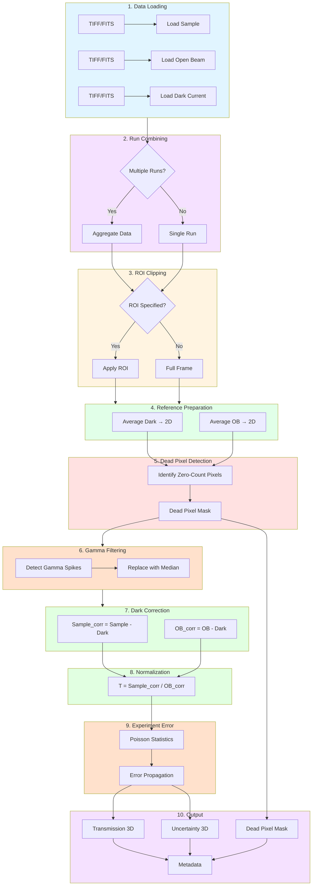

# MARS CCD/CMOS Data Reduction Workflow

**Beamline**: MARS (HFIR)
**Detector**: CCD/CMOS camera
**Beam Type**: Continuous (no TOF)
**Applications**: nR (radiography), nCT (computed tomography), nGI (grating interferometry)

---

## Pipeline Flowchart



---

## 1. Inputs

| Input | Format | Required | Description |
|-------|--------|----------|-------------|
| Sample images | TIFF/FITS stack | Yes | Raw neutron transmission images |
| Open Beam (OB) | TIFF/FITS stack | Yes | Reference without sample |
| Dark Current | TIFF/FITS stack | No | Electronic noise baseline (beam off). Optional — omit `dark_paths` (or pass `[]`) to skip dark correction. |
| ROI | (x0, y0, x1, y1) | No | Region of interest to crop |

**Metadata** (from files or user):
- Acquisition time per image
- Detector gain settings

---

## 2. Processing Pipeline

```
┌─────────────────────────────────────────────────────────────────┐
│  STEP 1: Load Data                                              │
│  ────────────────                                               │
│  • Load Sample stack → 3D array (N_images, y, x)                │
│  • Load OB stack → 3D array (N_ob, y, x)                        │
│  • Load Dark Current stack → 3D array (N_dark, y, x)            │
│  • Validate dimensions match (y, x must be same)                │
└─────────────────────────────────────────────────────────────────┘
                              ↓
┌─────────────────────────────────────────────────────────────────┐
│  STEP 2: Run Combining (Optional)                               │
│  ────────────────────────────────                               │
│  IF multiple runs provided:                                     │
│    • Aggregate sample images across runs                        │
│    • Aggregate OB images across runs                            │
│    • Aggregate dark images across runs                          │
│    • Average ExposureTime across runs (normalize_by_runs=True)  │
└─────────────────────────────────────────────────────────────────┘
                              ↓
┌─────────────────────────────────────────────────────────────────┐
│  STEP 3: ROI Clipping (Optional)                                │
│  ───────────────────────────────                                │
│  IF ROI specified:                                              │
│    • Crop all arrays to ROI: arr[:, y0:y1, x0:x1]               │
└─────────────────────────────────────────────────────────────────┘
                              ↓
┌─────────────────────────────────────────────────────────────────┐
│  STEP 4: Prepare Reference Images                               │
│  ────────────────────────────────                               │
│  • Average dark images: Dark_avg = mean(Dark, axis=0) → 2D      │
│  • Average OB images: OB_avg = mean(OB, axis=0) → 2D            │
│  • (Or use median for robustness against outliers)              │
└─────────────────────────────────────────────────────────────────┘
                              ↓
┌─────────────────────────────────────────────────────────────────┐
│  STEP 5: Dead Pixel Detection                                   │
│  ────────────────────────────                                   │
│  • Identify Sample pixels with zero total counts, summed over   │
│    the image-stack dimension (N_image)                          │
│  • dead_mask = (Sample.sum(N_image) == 0)                       │
│  • Output: 2D boolean mask                                      │
└─────────────────────────────────────────────────────────────────┘
                              ↓
┌─────────────────────────────────────────────────────────────────┐
│  STEP 6: Gamma Filtering                                        │
│  ───────────────────────                                        │
│  CRITICAL for MARS (SANS beamline contamination)                │
│                                                                 │
│  FOR each image in Sample stack:                                │
│    • Detect gamma spikes (outliers > threshold)                 │
│    • Replace with local median (3x3 neighborhood)               │
│                                                                 │
│  (Gamma filtering is applied to the Sample only, not the OB.)   │
│                                                                 │
│  Methods:                                                       │
│    a) Automatic: threshold = data_max * factor                  │
│    b) Manual: user-specified threshold                          │
│    c) Statistical: z-score based outlier detection              │
└─────────────────────────────────────────────────────────────────┘
                              ↓
┌─────────────────────────────────────────────────────────────────┐
│  STEP 7: Dark Current Correction                                │
│  ───────────────────────────────                                │
│  FOR each image i in Sample stack:                              │
│    Sample_corr[i] = Sample[i] - Dark_avg                        │
│                                                                 │
│  OB_corr = OB_avg - Dark_avg                                    │
│                                                                 │
│  Handle negative values:                                        │
│    • Clip to zero OR                                            │
│    • Flag as invalid                                            │
└─────────────────────────────────────────────────────────────────┘
                              ↓
┌─────────────────────────────────────────────────────────────────┐
│  STEP 8: Normalization                                          │
│  ─────────────────────                                          │
│  FOR each image i:                                              │
│                                                                 │
│    T[i] = Sample_corr[i] / OB_corr                              │
│                                                                 │
│  Handle division:                                               │
│    • dead_mask carried as a scipp mask (not NaN-filled)         │
│    • Where OB_corr == 0: T is inf/nan (division artifact only)  │
│                                                                 │
│  Formula:                                                       │
│    T = (I_sample - I_dark) / (I_OB - I_dark)                    │
└─────────────────────────────────────────────────────────────────┘
                              ↓
┌─────────────────────────────────────────────────────────────────┐
│  STEP 9: Experiment Error Propagation                           │
│  ────────────────────────────────────                           │
│  Poisson statistics for CCD counts:                             │
│    σ_sample = √(Sample)                                         │
│    σ_OB = √(OB_avg)                                             │
│    σ_dark = √(Dark_avg)                                         │
│                                                                 │
│  Error propagation through subtraction and division. The same  │
│  dark is shared by numerator and denominator, so its variance   │
│  is counted ONCE (issue #142): independent propagation is       │
│  corrected by subtracting the over-counted term                 │
│  2·S_corr·σ_D² / OB_corr³ from Var(T).                          │
│                                                                 │
│    Var(T) = σ_S²/OB_corr² + S_corr²·σ_OB²/OB_corr⁴              │
│             − 2·S_corr·σ_D² / OB_corr³                          │
│                                                                 │
│  Where (σ_S², σ_OB² already include σ_D² from the subtraction):│
│    S_corr = Sample - Dark                                       │
│    OB_corr = OB - Dark                                          │
└─────────────────────────────────────────────────────────────────┘
                              ↓
┌─────────────────────────────────────────────────────────────────┐
│  STEP 10: Output                                                │
│  ────────────                                                   │
│  • Transmission: 3D array (N_images, y, x) or (θ, y, x) for CT  │
│  • Experiment Error: 3D array (same shape as Transmission)      │
│  • Dead Pixel Mask: 2D boolean array (y, x)                     │
│  • Metadata: processing parameters, provenance                  │
└─────────────────────────────────────────────────────────────────┘
```

---

## 3. Output Specification

| Output | Dimensions | dtype | Description |
|--------|------------|-------|-------------|
| Transmission | (θ, y, x) | float32 | Normalized transmission values |
| Experiment Error | (θ, y, x) | float32 | Propagated uncertainty (1σ) |
| Dead Pixel Mask | (y, x) | bool | True = dead pixel |
| Metadata | dict | - | Processing provenance |

The pipeline computes in **float32 end-to-end** — TIFF/FITS images are loaded as
float32 and all processing (combine, dark correction, normalization, uncertainty
propagation) stays float32. float32 is sufficient for neutron imaging (16-bit
detectors) and halves the in-memory footprint of large stacks.

**Metadata contents**:
- Input file paths (sample, OB, and dark if dark correction applied)
- Whether gamma filtering was applied (`gamma_filter_applied`)
- Whether dark correction was applied (`dark_correction_applied`)
- Processing timestamp
- ROI applied (if any)
- Software version

---

## 4. Decision Points

| Step | Decision | Options |
|------|----------|---------|
| 2 | Multiple runs? | Combine or single run |
| 3 | ROI needed? | Apply crop or full frame |
| 4 | OB averaging | Mean vs Median |
| 6 | Gamma filter method | Automatic / Manual / Statistical |
| 7 | Negative value handling | Clip to zero / Flag invalid |

---

## 5. Development Components

### Required Modules

| Component | Purpose | Priority |
|-----------|---------|----------|
| `loaders.tiff_loader` | Load TIFF stacks | P0 |
| `loaders.fits_loader` | Load FITS stacks | P0 |
| `processing.run_combiner` | Aggregate multiple runs | P1 |
| `processing.roi_clipper` | Apply ROI to arrays | P1 |
| `tof.pixel_detector` | Identify dead pixels | P0 |
| `filters.gamma_filter` | Remove gamma contamination | P0 |
| `processing.dark_corrector` | Subtract dark current | P0 |
| `processing.normalizer` | Compute transmission | P0 |
| `processing.uncertainty_calculator` | Error propagation | P0 |
| `exporters.hdf5_writer` / `exporters.tiff_writer` | Write results | P0 |

### Data Models

```
InputData:
  - sample: NDArray[float32]  # (N, y, x)
  - open_beam: NDArray[float32]  # (N_ob, y, x)
  - dark_current: NDArray[float32]  # (N_dark, y, x)
  - roi: Optional[Tuple[int, int, int, int]]
  - metadata: Dict

ProcessedData:
  - transmission: NDArray[float32]  # (N, y, x)
  - uncertainty: NDArray[float32]  # (N, y, x)
  - dead_pixel_mask: NDArray[bool]  # (y, x)
  - metadata: Dict
```

---

## 6. Validation Criteria

- [ ] Transmission values in expected range (typically 0-1, may exceed 1 due to scattering)
- [ ] inf/nan only at zero-denominator (OB) pixels; masks are preserved, not value-filled
- [ ] Uncertainty > 0 for all valid pixels
- [ ] Dead pixel mask correctly identifies zero-count pixels
- [ ] Gamma filtering removes spikes without affecting valid data
