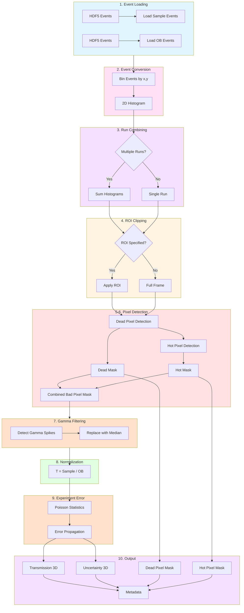

# MARS TPX3 Data Reduction Workflow

**Beamline**: MARS (HFIR)
**Detector**: Timepix3 (TPX3)
**Beam Type**: Continuous (no TOF)
**Applications**: nR (radiography), nCT (computed tomography), nGI (grating interferometry)

---

## Pipeline Flowchart



---

## 1. Inputs

| Input | Format | Required | Description |
|-------|--------|----------|-------------|
| Sample events | Event files (HDF5) | Yes | Neutron events (x, y, ToT) |
| Open Beam events | Event files (HDF5) | Yes | Reference events without sample |
| ROI | (x0, y0, x1, y1) | No | Region of interest to crop |

**Metadata** (from files):
- Acquisition time
- Total event count

**Key Differences from CCD/CMOS**:
- No dark current correction (counting detector - no electronic baseline)
- Event data → histogram conversion required
- Hot pixel detection required (radiation damage causes false counts)

---

## 2. Processing Pipeline

```
┌─────────────────────────────────────────────────────────────────┐
│  STEP 1: Load Event Data                                        │
│  ───────────────────────                                        │
│  • Load Sample event files → event list (x, y, ToT)             │
│  • Load OB event files → event list (x, y, ToT)                 │
│  • Extract acquisition metadata                                 │
│                                                                 │
│  Note: TPX3 events include ToT (Time over Threshold) which      │
│  correlates with deposited energy. At MARS, TOF not used.       │
└─────────────────────────────────────────────────────────────────┘
                              ↓
┌─────────────────────────────────────────────────────────────────┐
│  STEP 2: Event-to-Histogram Conversion                          │
│  ─────────────────────────────────────                          │
│  Convert event lists to 2D histograms (no TOF at MARS):         │
│                                                                 │
│  FOR each acquisition:                                          │
│    • Bin events by (x, y) position                              │
│    • Sample_hist[i] = histogram(events_sample, bins=(y, x))     │
│    • Result: 2D count image per acquisition                     │
│                                                                 │
│  OB_hist = histogram(events_OB, bins=(y, x))                    │
│                                                                 │
│  Output: Sample as 3D (N_images, y, x), OB as 2D (y, x)         │
└─────────────────────────────────────────────────────────────────┘
                              ↓
┌─────────────────────────────────────────────────────────────────┐
│  STEP 3: Run Combining (Optional)                               │
│  ────────────────────────────────                               │
│  IF multiple runs provided:                                     │
│    • Sum histograms across runs                                 │
│    • Sum acquisition time metadata                              │
│    • Track partial dead/hot pixels per run                      │
└─────────────────────────────────────────────────────────────────┘
                              ↓
┌─────────────────────────────────────────────────────────────────┐
│  STEP 4: ROI Clipping (Optional)                                │
│  ───────────────────────────────                                │
│  IF ROI specified:                                              │
│    • Crop all histogram arrays to ROI                           │
└─────────────────────────────────────────────────────────────────┘
                              ↓
┌─────────────────────────────────────────────────────────────────┐
│  STEP 5: Dead Pixel Detection                                   │
│  ────────────────────────────                                   │
│  • Identify pixels with zero counts in OB histogram             │
│  • dead_mask = (OB_hist == 0)                                   │
│  • Output: 2D boolean mask                                      │
└─────────────────────────────────────────────────────────────────┘
                              ↓
┌─────────────────────────────────────────────────────────────────┐
│  STEP 6: Hot Pixel Detection                                    │
│  ───────────────────────────                                    │
│  TPX3-specific: radiation damage causes false counts            │
│                                                                 │
│  Detection methods:                                             │
│    a) Statistical: pixels with anomalously high count rate      │
│       hot_mask = (OB_hist > median + k×σ)                       │
│    b) Temporal: inconsistent counts across acquisitions         │
│    c) ToT-based: events with abnormal ToT values                │
│                                                                 │
│  Output: 2D boolean hot_pixel_mask                              │
│                                                                 │
│  Combined mask: bad_pixels = dead_mask | hot_mask               │
└─────────────────────────────────────────────────────────────────┘
                              ↓
┌─────────────────────────────────────────────────────────────────┐
│  STEP 7: Gamma Filtering                                        │
│  ───────────────────────                                        │
│  CRITICAL for MARS (SANS beamline contamination)                │
│                                                                 │
│  FOR each histogram image:                                      │
│    • Detect gamma spikes (outliers > threshold)                 │
│    • Replace with local median (3x3 neighborhood)               │
│                                                                 │
│  Note: Gamma events may have distinct ToT signature -           │
│  could filter at event level before histogramming               │
│                                                                 │
│  Methods:                                                       │
│    a) Histogram-based: same as CCD/CMOS                         │
│    b) Event-level: filter by ToT before histogramming           │
└─────────────────────────────────────────────────────────────────┘
                              ↓
┌─────────────────────────────────────────────────────────────────┐
│  STEP 8: Normalization                                          │
│  ─────────────────────                                          │
│  FOR each image i:                                              │
│                                                                 │
│    T[i] = Sample_hist[i] / OB_hist                              │
│                                                                 │
│  Handle division:                                               │
│    • Where bad_pixels=True: T = NaN                             │
│    • Where OB_hist == 0: T = NaN                                │
│                                                                 │
│  Formula (no dark current subtraction):                         │
│    T = I_sample / I_OB                                          │
└─────────────────────────────────────────────────────────────────┘
                              ↓
┌─────────────────────────────────────────────────────────────────┐
│  STEP 9: Experiment Error Propagation                           │
│  ────────────────────────────────────                           │
│  Poisson statistics for counting detector:                      │
│    σ_sample = √(N_sample)                                       │
│    σ_OB = √(N_OB)                                               │
│                                                                 │
│  Error propagation for division:                                │
│                                                                 │
│    σ_T = T × √[ 1/N_sample + 1/N_OB ]                           │
│                                                                 │
│  Simplified (no dark current term):                             │
│    σ_T/T = √[ (σ_S/S)² + (σ_OB/OB)² ]                           │
│          = √[ 1/N_S + 1/N_OB ]                                  │
└─────────────────────────────────────────────────────────────────┘
                              ↓
┌─────────────────────────────────────────────────────────────────┐
│  STEP 10: Output                                                │
│  ────────────                                                   │
│  • Transmission: 3D array (N_images, y, x) or (θ, y, x) for CT  │
│  • Experiment Error: 3D array (same shape as Transmission)      │
│  • Dead Pixel Mask: 2D boolean array (y, x)                     │
│  • Hot Pixel Mask: 2D boolean array (y, x)                      │
│  • Metadata: processing parameters, provenance                  │
└─────────────────────────────────────────────────────────────────┘
```

---

## 3. Output Specification

| Output | Dimensions | dtype | Description |
|--------|------------|-------|-------------|
| Transmission | (θ, y, x) | float32 | Normalized transmission values |
| Experiment Error | (θ, y, x) | float32 | Propagated uncertainty (1σ) |
| Dead Pixel Mask | (y, x) | bool | True = dead pixel |
| Hot Pixel Mask | (y, x) | bool | True = hot pixel (TPX3-specific) |
| Metadata | dict | - | Processing provenance |

**Metadata contents**:
- Input file paths
- Processing timestamp
- Event-to-histogram binning parameters
- Gamma filter parameters used
- Hot pixel detection parameters
- ROI applied (if any)
- Number of runs combined (if any)
- Software version

---

## 4. Decision Points

| Step | Decision | Options |
|------|----------|---------|
| 2 | Event binning resolution | Native detector / Custom |
| 3 | Multiple runs? | Combine or single run |
| 4 | ROI needed? | Apply crop or full frame |
| 6 | Hot pixel method | Statistical / Temporal / ToT-based |
| 7 | Gamma filter level | Event-level / Histogram-level / Both |

---

## 5. Development Components

### Required Modules

| Component | Purpose | Priority |
|-----------|---------|----------|
| `loaders.event_loader` | Load TPX3 event files | P0 |
| `tof.event_converter` | Convert events to histogram | P0 |
| `processing.run_combiner` | Aggregate multiple runs | P1 |
| `processing.roi_clipper` | Apply ROI to arrays | P1 |
| `processing.dead_pixel_detector` | Identify dead pixels | P0 |
| `processing.hot_pixel_detector` | Identify hot pixels (TPX3) | P0 |
| `filters.gamma_filter` | Remove gamma contamination | P0 |
| `processing.normalizer` | Compute transmission | P0 |
| `processing.uncertainty_calculator` | Error propagation | P0 |
| `exporters.output_writer` | Write results | P0 |

### Data Models

```
EventData:
  - x: NDArray[uint16]       # pixel x coordinate
  - y: NDArray[uint16]       # pixel y coordinate
  - tot: NDArray[uint16]     # Time over Threshold
  - metadata: Dict           # acquisition info

InputData:
  - sample_events: List[EventData]  # per acquisition
  - ob_events: EventData
  - roi: Optional[Tuple[int, int, int, int]]
  - metadata: Dict

ProcessedData:
  - transmission: NDArray[float32]  # (N, y, x)
  - uncertainty: NDArray[float32]   # (N, y, x)
  - dead_pixel_mask: NDArray[bool]  # (y, x)
  - hot_pixel_mask: NDArray[bool]   # (y, x)
  - metadata: Dict
```

---

## 6. Key Differences from MARS CCD/CMOS

| Aspect | CCD/CMOS | TPX3 |
|--------|----------|------|
| Input format | TIFF/FITS stacks | Event files |
| Dark current | Required | Not needed |
| Hot pixels | Not applicable | Required detection |
| Gamma filter | Histogram only | Event or histogram level |
| Error formula | Includes dark term | Simpler (no dark) |
| Data conversion | None | Event → histogram |

---

## 7. Validation Criteria

- [ ] Event-to-histogram conversion preserves total counts
- [ ] Transmission values in expected range
- [ ] No NaN values except where bad_pixels=True
- [ ] Uncertainty > 0 for all valid pixels
- [ ] Hot pixel mask identifies anomalous count pixels
- [ ] Dead pixel mask identifies zero-count pixels
- [ ] Gamma filtering removes spikes without affecting valid data
