# VENUS CCD/CMOS Data Reduction Workflow

**Beamline**: VENUS (SNS)
**Detector**: CCD/CMOS camera
**Beam Type**: Pulsed (no TOF for CCD/CMOS - integrating detector)
**Applications**: nR (radiography), nCT (computed tomography)

---

## Pipeline Flowchart

```mermaid
flowchart TD
    subgraph Input["1. Data Loading"]
        A1[TIFF/FITS] --> A[Load Sample]
        A2[TIFF/FITS] --> B[Load Open Beam]
        A3[TIFF/FITS] --> C[Load Dark Current]
        A4[DAQ] --> M[Load p_charge]
    end

    subgraph RunCombine["2. Run Combining"]
        RC1{Multiple Runs?}
        RC2[Aggregate Data + Average p_charge]
        RC3[Single Run]
    end

    subgraph ROI["3. ROI Clipping"]
        D{ROI Specified?}
        E[Apply ROI]
        F[Full Frame]
    end

    subgraph Prepare["4. Reference Preparation"]
        G[Average Dark → 2D]
        H[Average OB → 2D]
    end

    subgraph PixelDetect["5. Dead Pixel Detection"]
        PD[Identify Zero-Count Pixels]
        PM[Dead Pixel Mask]
    end

    subgraph Gamma["6. Gamma Filtering"]
        GF{Gamma Filter?}
        GY[Apply Filter]
        GN[Skip]
    end

    subgraph DarkCorr["7. Dark Correction"]
        DC1["Sample_corr = Sample - Dark"]
        DC2["OB_corr = OB - Dark"]
    end

    subgraph BeamCorr["8. p_charge Correction"]
        BC["f = p_charge_OB / p_charge_Sample"]
    end

    subgraph Norm["9. Normalization"]
        N["T = (Sample_corr / OB_corr) × f"]
    end

    subgraph AirCorr["10. Air Region Correction (Optional)"]
        AC1{Air ROI?}
        AC2["T_final = T / mean(T_air)"]
        AC3[Skip]
    end

    subgraph UQ["11. Experiment Error"]
        UQ1[Poisson + p_charge σ]
        UQ2[Error Propagation]
    end

    subgraph Output["12. Output"]
        O1[Transmission 3D]
        O2[Uncertainty 3D]
        O3[Dead Pixel Mask]
        O4[Metadata]
    end

    Input --> RC1
    RC1 -->|Yes| RC2
    RC1 -->|No| RC3
    RC2 --> D
    RC3 --> D
    D -->|Yes| E
    D -->|No| F
    E --> Prepare
    F --> Prepare
    G --> PD
    H --> PD
    PD --> PM
    PM --> GF
    GF -->|Yes| GY
    GF -->|No| GN
    GY --> DarkCorr
    GN --> DarkCorr
    DC1 --> BC
    DC2 --> BC
    BC --> N
    N --> AC1
    AC1 -->|Yes| AC2
    AC1 -->|No| AC3
    AC2 --> UQ1
    AC3 --> UQ1
    UQ1 --> UQ2
    UQ2 --> O1
    UQ2 --> O2
    PM --> O3
    O1 --> O4
    O2 --> O4
    O3 --> O4

    style Input fill:#e1f5ff
    style RunCombine fill:#f5e1ff
    style ROI fill:#fff4e1
    style Prepare fill:#e1ffe8
    style PixelDetect fill:#ffe1e1
    style Gamma fill:#fff4e1
    style DarkCorr fill:#e1ffe1
    style BeamCorr fill:#e1f5ff
    style Norm fill:#e1ffe1
    style AirCorr fill:#fff4e1
    style UQ fill:#ffe1cc
    style Output fill:#f5e1ff
```



---

## 1. Inputs

| Input | Format | Required | Description |
|-------|--------|----------|-------------|
| Sample images | TIFF/FITS stack | Yes | Raw neutron transmission images |
| Open Beam (OB) | TIFF/FITS stack | Yes | Reference without sample |
| Dark Current | TIFF/FITS stack | No | Electronic noise baseline (beam off). Optional — omit `dark_paths` (or pass `[]`) to skip dark correction. |
| ROI | (x0, y0, x1, y1) | No | Region of interest to crop |
| Reference ROI | (x0, y0, x1, y1) | No | ROI for beam stability correction |

**Metadata** (from files or DAQ):
- Acquisition time per image
- p_charge (proton charge - beam intensity proxy)
- Detector gain settings

**Key Differences from MARS CCD/CMOS**:
- Beam stability correction required (pulsed source fluctuates)
- Run combining more critical (lower integrated flux)
- p_charge metadata available for beam correction

---

## 2. Processing Pipeline

```
┌─────────────────────────────────────────────────────────────────┐
│  STEP 1: Load Data                                              │
│  ────────────────                                               │
│  • Load Sample stack → 3D array (N_images, y, x)                │
│  • Load OB stack → 3D array (N_ob, y, x)                        │
│  • Load Dark Current stack → 3D array (N_dark, y, x)            │
│  • Load metadata: p_charge per image                            │
│  • Validate dimensions match (y, x must be same)                │
└─────────────────────────────────────────────────────────────────┘
                              ↓
┌─────────────────────────────────────────────────────────────────┐
│  STEP 2: Run Combining (Often Required for VENUS)               │
│  ────────────────────────────────────────────────               │
│  IF multiple runs provided:                                     │
│    • Aggregate sample images across runs                        │
│    • Aggregate OB images across runs                            │
│    • Aggregate dark images across runs                          │
│    • Average p_charge across runs (normalize_by_runs=True)      │
│    • Dead pixels detected once on the combined sample           │
│                                                                 │
│  Note: More important at VENUS due to lower integrated flux     │
└─────────────────────────────────────────────────────────────────┘
                              ↓
┌─────────────────────────────────────────────────────────────────┐
│  STEP 3: ROI Clipping (Optional)                                │
│  ───────────────────────────────                                │
│  IF ROI specified:                                              │
│    • Crop all arrays to ROI: arr[:, y0:y1, x0:x1]               │
└─────────────────────────────────────────────────────────────────┘
                              ↓
┌─────────────────────────────────────────────────────────────────┐
│  STEP 4: Prepare Reference Images                               │
│  ────────────────────────────────                               │
│  • Average dark images: Dark_avg = mean(Dark, axis=0) → 2D      │
│  • Average OB images: OB_avg = mean(OB, axis=0) → 2D            │
│  • Track p_charge_OB = mean(p_charge across OB runs)            │
└─────────────────────────────────────────────────────────────────┘
                              ↓
┌─────────────────────────────────────────────────────────────────┐
│  STEP 5: Dead Pixel Detection                                   │
│  ────────────────────────────                                   │
│  • Detect on the SAMPLE: pixels whose total counts, summed over │
│    the image-stack dimension (N_image), are exactly zero        │
│  • dead_mask = (Sample.sum(N_image) == 0)                       │
│  • Output: 2D boolean mask                                      │
└─────────────────────────────────────────────────────────────────┘
                              ↓
┌─────────────────────────────────────────────────────────────────┐
│  STEP 6: Gamma Filtering (Optional)                             │
│  ──────────────────────────────────                             │
│  Less critical at VENUS than MARS (no adjacent SANS beamline)   │
│                                                                 │
│  IF gamma filtering requested:                                  │
│    FOR each image:                                              │
│      • Detect gamma spikes (outliers > threshold)               │
│      • Replace with local median (3x3 neighborhood)             │
└─────────────────────────────────────────────────────────────────┘
                              ↓
┌─────────────────────────────────────────────────────────────────┐
│  STEP 7: Dark Current Correction                                │
│  ───────────────────────────────                                │
│  FOR each image i in Sample stack:                              │
│    Sample_corr[i] = Sample[i] - Dark_avg                        │
│                                                                 │
│  OB_corr = OB_avg - Dark_avg                                    │
│                                                                 │
│  Handle negative values: clip to zero or flag as invalid        │
└─────────────────────────────────────────────────────────────────┘
                              ↓
┌─────────────────────────────────────────────────────────────────┐
│  STEP 8: p_charge Beam Correction                               │
│  ────────────────────────────────                               │
│  PRIMARY correction for VENUS (pulsed source fluctuates)        │
│                                                                 │
│  FOR each image i:                                              │
│    f_beam[i] = p_charge_OB / p_charge_sample[i]                 │
│                                                                 │
│  Note: p_charge is proton charge from accelerator diagnostics   │
│  It correlates with neutron pulse intensity                     │
└─────────────────────────────────────────────────────────────────┘
                              ↓
┌─────────────────────────────────────────────────────────────────┐
│  STEP 9: Normalization                                          │
│  ─────────────────────                                          │
│  FOR each image i:                                              │
│                                                                 │
│    T[i] = (Sample_corr[i] / OB_corr) × f_beam[i]                │
│                                                                 │
│  Handle division:                                               │
│    • dead_mask is carried as a scipp mask (values not rewritten)│
│    • Where OB_corr == 0: T is inf/nan (division artifact)       │
│                                                                 │
│  Formula:                                                       │
│    T = [(I_sample - I_dark) / (I_OB - I_dark)] × f_p_charge     │
└─────────────────────────────────────────────────────────────────┘
                              ↓
┌─────────────────────────────────────────────────────────────────┐
│  STEP 10: Air Region Correction (Optional)                      │
│  ─────────────────────────────────────────                      │
│  Post-normalization refinement if p_charge wasn't sufficient    │
│                                                                 │
│  IF Air ROI specified:                                          │
│    1. Calculate mean transmission in air region:                │
│       <T_air> = mean(T[air_ROI])                                │
│                                                                 │
│    2. Scale to ensure air = 1.0:                                │
│       T_final = T / <T_air>                                     │
│                                                                 │
│  Goal: Correct residual beam fluctuations not captured by       │
│        p_charge. Air region should have T = 1.0 (no absorption) │
│                                                                 │
│  Note: This is "cherry on top" - only if p_charge insufficient  │
└─────────────────────────────────────────────────────────────────┘
                              ↓
┌─────────────────────────────────────────────────────────────────┐
│  STEP 11: Experiment Error Propagation                          │
│  ─────────────────────────────────────                          │
│  Sources of uncertainty:                                        │
│    • Poisson: σ_counts = √(N)                                   │
│    • p_charge: σ_p (Gaussian, from DAQ)                         │
│    • Air region: σ_air (if air correction applied)              │
│                                                                 │
│  Combined error propagation:                                    │
│                                                                 │
│  normalize_with_dark counts the shared dark ONCE (issue #142):  │
│  it propagates Var(D) through S_corr and OB_corr, then          │
│  subtracts the over-count 2·k²·S_corr·σ_D²/OB_corr³             │
│  (k = p_OB/p_sample). The σ_S, σ_OB and p_charge terms are:     │
│                                                                 │
│    Var(T) = T² × [ (σ_S/S_corr)² + (σ_OB/OB_corr)²              │
│                  + (σ_p_sample/p_sample)² + (σ_p_OB/p_OB)² ]    │
│             + Var(D) dark term (shared-dark corrected, see #142) │
│                                                                 │
│  If air correction applied: add (σ_air/<T_air>)² term           │
└─────────────────────────────────────────────────────────────────┘
                              ↓
┌─────────────────────────────────────────────────────────────────┐
│  STEP 12: Output                                                │
│  ────────────                                                   │
│  • Transmission: 3D array (N_images, y, x) or (θ, y, x) for CT  │
│  • Experiment Error: 3D array (same shape as Transmission)      │
│  • Dead Pixel Mask: 2D boolean array (y, x)                     │
│  • Metadata: processing parameters, provenance                  │
└─────────────────────────────────────────────────────────────────┘
```

---

## 3. Output Specification

| Output | Dimensions | dtype | Description |
|--------|------------|-------|-------------|
| Transmission | (θ, y, x) | float32 | Normalized transmission values |
| Experiment Error | (θ, y, x) | float32 | Propagated uncertainty (1σ) |
| Dead Pixel Mask | (y, x) | bool | True = dead pixel |
| Metadata | dict | - | Processing provenance |

The pipeline computes in **float32 end-to-end** — TIFF/FITS images are loaded as
float32 and all processing (combine, dark correction, normalization, uncertainty
propagation) stays float32. float32 is sufficient for neutron imaging (16-bit
detectors) and halves the in-memory footprint of large stacks.

**Metadata contents**:
- Sample and OB file paths
- Gamma filter applied (yes/no)
- Dark correction applied (yes/no)
- Processing timestamp
- Software version
- Dark file paths (if dark correction applied)
- ROI applied (if any)

---

## 4. Decision Points

| Step | Decision | Options |
|------|----------|---------|
| 2 | Multiple runs? | Combine or single run |
| 3 | ROI needed? | Apply crop or full frame |
| 4 | OB averaging | Mean vs Median |
| 6 | Gamma filtering? | Apply / Skip |
| 8 | p_charge available? | Apply (default) / Skip (not recommended) |
| 10 | Air region correction? | Apply if p_charge insufficient / Skip |

---

## 5. Development Components

### Required Modules

| Component | Purpose | Priority |
|-----------|---------|----------|
| `loaders.tiff_loader` | Load TIFF stacks | P0 |
| `loaders.fits_loader` | Load FITS stacks | P0 |
| `loaders.metadata_loader` | Extract p_charge from DAQ | P0 |
| `processing.run_combiner` | Aggregate multiple runs | P0 (critical for VENUS) |
| `processing.roi_clipper` | Apply ROI to arrays | P1 |
| `tof.pixel_detector` | Identify dead pixels | P0 |
| `filters.gamma_filter` | Remove gamma contamination | P1 |
| `processing.dark_corrector` | Subtract dark current | P0 |
| `processing.normalizer` | Apply p_charge correction | P0 |
| `processing.normalizer` | Compute transmission | P0 |
| `processing.air_region_corrector` | Optional post-normalization correction | P1 |
| `processing.uncertainty_calculator` | Error propagation | P0 |
| `exporters.hdf5_writer` / `exporters.tiff_writer` | Write results (HDF5 primary; TIFF optional) | P0 |

### Data Models

```
InputData:
  - sample: NDArray[float32]       # (N, y, x)
  - open_beam: NDArray[float32]    # (N_ob, y, x)
  - dark_current: NDArray[float32] # (N_dark, y, x)
  - p_charge_sample: NDArray[float32]  # per image
  - p_charge_OB: float32           # total for OB
  - roi: Optional[Tuple[int, int, int, int]]
  - reference_roi: Optional[Tuple[int, int, int, int]]
  - metadata: Dict

ProcessedData:
  - transmission: NDArray[float32]  # (N, y, x)
  - uncertainty: NDArray[float32]   # (N, y, x)
  - dead_pixel_mask: NDArray[bool]  # (y, x)
  - metadata: Dict
```

---

## 6. Key Differences from MARS CCD/CMOS

| Aspect | MARS CCD/CMOS | VENUS CCD/CMOS |
|--------|---------------|----------------|
| Beam type | Continuous | Pulsed |
| Beam correction | Not needed | Required (p_charge or ROI) |
| Run combining | Optional | Often required |
| Gamma filtering | Critical | Optional |
| p_charge metadata | Not available | Available from DAQ |
| Error propagation | Poisson only | Poisson + p_charge |

---

## 7. Validation Criteria

- [ ] Transmission values in expected range (typically 0-1)
- [ ] inf/nan only at zero-OB pixels (dead pixels carried as a mask, not NaN-filled)
- [ ] Uncertainty > 0 for all valid pixels
- [ ] Dead pixel mask correctly identifies zero-count pixels
- [ ] Beam correction factor close to 1.0 (significant deviation indicates issues)
- [ ] p_charge correlation check between sample and OB
