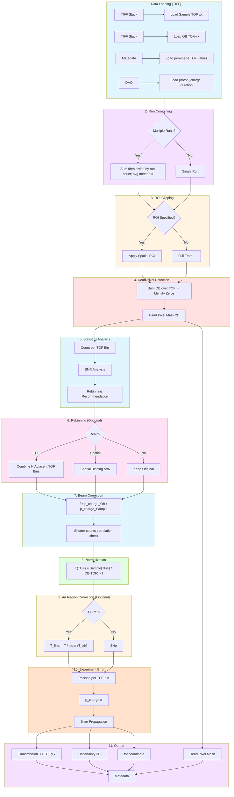

# VENUS TPX1 Data Reduction Workflow

**Beamline**: VENUS (SNS)
**Detector**: Timepix1 (TPX1)
**Beam Type**: Pulsed with TOF
**Data Mode**: Histogram (frame-mode, TOF bins fixed at acquisition)
**Input Format**: TIFF stacks (efficiency-corrected)
**Applications**: Bragg edge imaging, resonance imaging, hyperspectral nCT

---

## Data Flow Overview

```
EXTERNAL (Auto-Reduction):
  TPX1 Detector → FITS (raw histogram) → Efficiency correction → TIFF stacks

NeuNorm Pipeline:
  Input: TIFF stacks (TOF, y, x) - efficiency-corrected, TOF bins fixed
```

---

## Pipeline Flowchart



---

## 1. Inputs

| Input | Format | Required | Description |
|-------|--------|----------|-------------|
| Sample data | TIFF stack | Yes | 3D histogram (TOF, y, x), efficiency-corrected |
| Open Beam (OB) | TIFF stack | Yes | 3D reference (TOF, y, x), efficiency-corrected |
| TOF bin edges | Metadata/file | Yes | Time-of-flight bin boundaries (fixed at acquisition) |
| ROI | (x0, y0, x1, y1) | No | Spatial region of interest |

**Metadata** (from files or DAQ):

- Acquisition time per frame
- p_charge (proton charge - beam intensity proxy)
- shutter_counts (number of neutron pulses captured per frame)
- Source-to-detector distance (L)

**Key Characteristics**:

- **Frame mode**: Detector operates in frame readout mode with histogram accumulation
- **No dark current correction**: Counting detector (not integrating)
- **Efficiency pre-corrected**: Input TIFFs already have detector efficiency correction applied (external auto-reduction)
- **TOF bins fixed at acquisition**: Rebinning limited to combining adjacent bins
- **Shutter counts**: A metadata field (pulses per frame); **not currently loaded or used** by the TPX1 pipeline

---

## 2. Processing Pipeline

```
┌─────────────────────────────────────────────────────────────────┐
│  STEP 1: Load Data (TIFF Stacks)                                │
│  ───────────────────────────────                                │
│  • Load Sample TIFF stack → 3D array (TOF, y, x)               │
│    (TIFF stack dim N_image renamed to tof; no rotation axis)    │
│  • Load OB TIFF stack → 3D array (TOF, y, x)                    │
│  • Load per-image TOF values → 1D array (N_images,)            │
│  • Load metadata: proton_charge (p_charge), duration            │
│  • Validate dimensions match                                    │
└─────────────────────────────────────────────────────────────────┘
                              ↓
┌─────────────────────────────────────────────────────────────────┐
│  STEP 2: Run Combining (Critical for VENUS)                     │
│  ──────────────────────────────────────────                     │
│  IF multiple runs provided (normalize_by_runs=True):            │
│    • Sum histogram data across runs, then divide by run count   │
│      (sample, OB separately) → per-run average                  │
│    • Average proton_charge across runs (sc.mean)                │
│    • Average duration across runs (sc.mean)                     │
│    • Dead pixels detected post-combine, not per run             │
│      (re-detected if spatial rebinning is applied)              │
│                                                                 │
│  Note: All runs must have same TOF bin edges                    │
└─────────────────────────────────────────────────────────────────┘
                              ↓
┌─────────────────────────────────────────────────────────────────┐
│  STEP 3: ROI Clipping (Optional)                                │
│  ───────────────────────────────                                │
│  IF ROI specified:                                              │
│    • Crop spatial dimensions: arr[..., y0:y1, x0:x1]            │
│    • TOF dimension unchanged                                    │
└─────────────────────────────────────────────────────────────────┘
                              ↓
┌─────────────────────────────────────────────────────────────────┐
│  STEP 4: Dead Pixel Detection                                   │
│  ────────────────────────────                                   │
│  • Sum OB across TOF dimension: OB_summed = sum(OB, axis=TOF)   │
│  • Identify pixels with zero total counts                       │
│  • dead_mask = (OB_summed == 0)                                 │
│  • Output: 2D boolean mask (y, x)                               │
└─────────────────────────────────────────────────────────────────┘
                              ↓
┌─────────────────────────────────────────────────────────────────┐
│  STEP 5: Statistics Analysis & Rebinning Recommendation         │
│  ──────────────────────────────────────────────────────         │
│  Analyze count statistics per TOF bin:                          │
│                                                                 │
│  FOR each TOF bin t:                                            │
│    • N_counts[t] = sum(OB[t, :, :])  (excluding dead pixels)    │
│    • SNR[t] = √(N_counts[t])                                    │
│                                                                 │
│  Generate recommendation:                                       │
│    • Identify bins with inadequate statistics (SNR < threshold) │
│    • Recommend rebinning factor N (combine N adjacent bins)     │
│    • Or recommend spatial binning (NxN pixels)                  │
└─────────────────────────────────────────────────────────────────┘
                              ↓
┌─────────────────────────────────────────────────────────────────┐
│  STEP 6: Rebinning (Optional)                                   │
│  ────────────────────────────                                   │
│  IF rebinning requested:                                        │
│                                                                 │
│  Option A: TOF rebinning (combine N adjacent bins)              │
│    • Sum counts from N adjacent TOF bins                        │
│    • Update TOF bin edges: edges[::N]                           │
│    • Reduces TOF dimension by factor N                          │
│                                                                 │
│  Option B: Spatial rebinning (NxN pixel binning)                │
│    • Sum counts from NxN pixel blocks                           │
│    • Reduces (y, x) dimensions by factor N                      │
│    • Preserves TOF resolution                                   │
│                                                                 │
│  Note: Both options can be combined                             │
│  Note: Rebinning sums counts, preserving Poisson statistics     │
└─────────────────────────────────────────────────────────────────┘
                              ↓
┌─────────────────────────────────────────────────────────────────┐
│  STEP 7: Beam Correction                                        │
│  ───────────────────────                                        │
│  PRIMARY correction for VENUS pulsed source                     │
│                                                                 │
│  p_charge correction:                                           │
│    f_beam = p_charge_OB / p_charge_sample                       │
│                                                                 │
│  Note: shutter_counts is not loaded/used by the TPX1 pipeline.  │
│                                                                 │
│  Note: Correction factor applies uniformly across all TOF bins  │
└─────────────────────────────────────────────────────────────────┘
                              ↓
┌─────────────────────────────────────────────────────────────────┐
│  STEP 8: Normalization                                          │
│  ─────────────────────                                          │
│  FOR each TOF bin t:                                            │
│                                                                 │
│    T[t, y, x] = (Sample[t, y, x] / OB[t, y, x]) × f_beam        │
│                                                                 │
│                                                                 │
│  Handle division:                                               │
│    • Dead pixels carried as a scipp mask, not NaN-filled        │
│    • Where OB[t, y, x] == 0: division yields inf/nan (mask      │
│      before calling; not explicitly replaced with NaN)          │
│                                                                 │
│  Formula:                                                       │
│    T(TOF) = [I_sample(TOF) / I_OB(TOF)] × f_beam                │
└─────────────────────────────────────────────────────────────────┘
                              ↓
┌─────────────────────────────────────────────────────────────────┐
│  STEP 9: Air Region Correction (Optional)                       │
│  ─────────────────────────────────────────                      │
│  Post-normalization refinement if p_charge wasn't sufficient    │
│                                                                 │
│  IF Air ROI specified:                                          │
│    FOR each TOF bin t:                                          │
│      1. Calculate mean transmission in air region:              │
│         <T_air(t)> = mean(T[air_ROI, t])                        │
│                                                                 │
│      2. Scale to ensure air = 1.0:                              │
│         T_final(t) = T(t) / <T_air(t)>                          │
│                                                                 │
│  Note: Always averages over (x, y); other dims (e.g. TOF) are   │
│        preserved, so scaling is per-TOF-bin (no mode option)    │
└─────────────────────────────────────────────────────────────────┘
                              ↓
┌─────────────────────────────────────────────────────────────────┐
│  STEP 10: Experiment Error Propagation                          │
│  ─────────────────────────────────────                          │
│  Sources of uncertainty:                                        │
│    • Poisson: σ_N = √(N) for counts per TOF bin                 │
│    • p_charge: σ_p (Gaussian, from DAQ measurement)             │
│    • Air region: σ_air (if air correction applied)              │
│                                                                 │
│  Error propagation per TOF bin:                                 │
│                                                                 │
│    σ_T(TOF) = T(TOF) × √[ 1/N_sample(TOF) + 1/N_OB(TOF) +       │
│                           (σ_p_sample/p_sample)² +              │
│                           (σ_p_OB/p_OB)² ]                      │
│                                                                 │
│  Note: For rebinned data, counts are summed so σ = √(sum)       │
│  If air correction: add (σ_air/<T_air>)² term                   │
└─────────────────────────────────────────────────────────────────┘
                              ↓
┌─────────────────────────────────────────────────────────────────┐
│  STEP 11: Output                                                │
│  ────────────                                                   │
│  • Transmission: 3D array (TOF, y, x)                           │
│  • Experiment Error: 3D array (same shape)                      │
│  • tof coordinate: one TOF value per image (written by name)    │
│  • Dead Pixel Mask: 2D boolean array (y, x)                     │
│  • Metadata: processing parameters, provenance                  │
└─────────────────────────────────────────────────────────────────┘
```

---

## 3. Output Specification

| Output | Dimensions | dtype | Description |
|--------|------------|-------|-------------|
| Transmission | (TOF, y, x) | float32 | TOF-resolved transmission |
| Experiment Error | (TOF, y, x) | float32 | Propagated uncertainty (1σ) |
| tof coordinate | (N_images,) | float64 | One TOF value per image (written by coord name) |
| Dead Pixel Mask | (y, x) | bool | True = dead pixel |
| Metadata | dict | - | Processing provenance |

**Metadata contents**:

- Input file paths (sample/OB HDF5 and TIFF paths)
- Processing timestamp
- Software version
- ROI applied (if any)

---

## 4. Coordinate Conversions

TOF can be converted to energy or wavelength using the flight path length and the
detector time offset (`detector_time_offset` from metadata, issue #141):

```
TOF → Wavelength:
  λ = (h × (TOF + offset)) / (m_n × L)

TOF → Energy:
  E = (1/2) × m_n × (L / (TOF + offset))²

where:
  h = Planck's constant
  m_n = neutron mass
  L = source-to-detector distance
  offset = detector time offset
```

---

## 5. Decision Points

| Step | Decision | Options |
|------|----------|---------|
| 2 | Multiple runs? | Combine or single run |
| 3 | ROI needed? | Apply crop or full frame |
| 5 | Statistics adequate? | Yes → proceed / No → recommend rebinning |
| 6 | Rebinning type | TOF (combine N bins) / Spatial (NxN) / None |
| 9 | Air region correction? | Apply if p_charge insufficient / Skip |

---

## 6. Rebinning Constraints

TPX1 histogram data has fixed TOF bins determined at acquisition. Rebinning options:

**TOF Rebinning** (`rebin_tof`, `unit` selects the mode):
- `bins` (default): combine N adjacent bins; new edges = `original_edges[::N]`,
  with the final original edge appended if `[::N]` did not already include it
- `manual` / `time` / `wavelength`: request edges by explicit list, time width, or
  wavelength width — requested edges are **snapped to the nearest original edge**
  (bins are never split), so the result still only combines adjacent original bins

**Spatial Rebinning**:
- Combine NxN pixel blocks
- Reduces spatial resolution
- Preserves TOF resolution

**Cannot do**:
- Split an existing bin or place an edge inside one (sub-original-bin resolution)
  — requested edges that fall mid-bin are snapped to the nearest original edge
- Heterogeneous (variable-width) edges are allowed via `manual`/`time`/`wavelength`,
  but only on the original boundaries; finer-than-acquisition binning requires
  event-mode data (TPX3)

---

## 7. Development Components

### Required Modules

| Component | Purpose | Priority |
|-----------|---------|----------|
| `loaders.tiff_loader` | Load TIFF histogram stacks | P0 |
| `loaders.metadata_loader` | Extract p_charge, shutter_counts, TOF edges | P0 |
| `processing.run_combiner` | Aggregate multiple runs | P0 |
| `processing.roi_clipper` | Apply ROI to arrays | P1 |
| `tof.pixel_detector` | Identify dead pixels | P0 |
| `tof.statistics_analyzer` | Analyze bin occupancy, compute SNR | P0 |
| `tof.histogram_rebinner` | Combine adjacent TOF bins | P0 |
| `processing.spatial_rebinner` | Combine NxN pixel blocks | P1 |
| `processing.normalizer` | Apply p_charge correction | P0 |
| `processing.normalizer` | Compute transmission | P0 |
| `processing.air_region_corrector` | Optional post-normalization correction | P1 |
| `processing.uncertainty_calculator` | Error propagation | P0 |
| `tof.coordinate_converter` | TOF ↔ λ ↔ E | P1 |
| `exporters.hdf5_writer` / `exporters.tiff_writer` | Write results (HDF5 primary; TIFF optional) | P0 |

### Data Models

```
InputData:
  - sample: NDArray[float32]         # (N, TOF, y, x) or (TOF, y, x)
  - open_beam: NDArray[float32]      # (TOF, y, x)
  - tof_edges: NDArray[float64]      # (N_bins + 1,)
  - p_charge_sample: float32
  - p_charge_OB: float32
  - flight_path_length: float32      # meters
  - roi: Optional[Tuple[int, int, int, int]]
  - metadata: Dict

RebinConfig:
  - tof_factor: Optional[int]        # combine N adjacent TOF bins
  - spatial_factor: Optional[int]    # combine NxN pixels

ProcessedData:
  - transmission: NDArray[float32]   # (TOF, y, x)
  - uncertainty: NDArray[float32]    # (TOF, y, x)
  - tof_edges: NDArray[float64]      # (N_bins + 1,) - updated if rebinned
  - dead_pixel_mask: NDArray[bool]   # (y, x)
  - metadata: Dict
```

---

## 8. Validation Criteria

- [ ] Transmission values in expected range per TOF bin
- [ ] inf/nan only at zero-denominator (OB) pixels; masks are preserved, not value-filled
- [ ] Uncertainty > 0 for all valid pixels and TOF bins
- [ ] Dead pixel mask correctly identifies zero-count pixels
- [ ] TOF bin edges monotonically increasing
- [ ] Rebinning preserves total counts
- [ ] Beam correction factor close to 1.0
