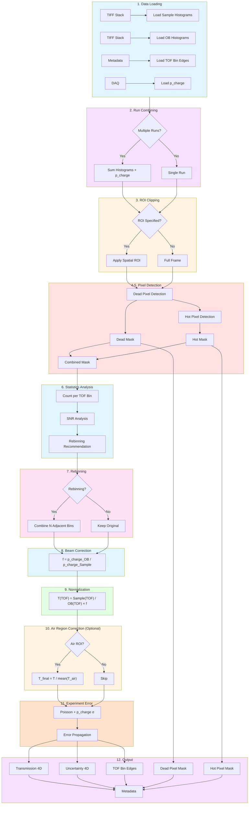

# VENUS TPX3 Data Reduction Workflow

**Beamline**: VENUS (SNS)
**Detector**: Timepix3 (TPX3)
**Beam Type**: Pulsed with TOF
**Applications**: Bragg edge imaging, resonance imaging, hyperspectral nCT, nGI

---

## Data Modes

TPX3 supports two operational modes with different input data:

| Mode | Input | Source | Binning Flexibility |
|------|-------|--------|---------------------|
| **Event Mode** | HDF5 event files | Raw detector output | Full (arbitrary bin schemes) |
| **Histogram Mode** | TIFF stacks | DAQ pipeline pre-binned | Limited (combine adjacent bins) |

---

## Part A: Event Mode Workflow

**Data Mode**: Event (raw neutron events with timing)

### A.1 Pipeline Flowchart

```mermaid
flowchart TD
    subgraph Input["1. Event Loading"]
        A1[HDF5 Events] --> A[Load Sample Events]
        A2[HDF5 Events] --> B[Load OB Events]
        A3[DAQ] --> C[Load Pulse Timestamps]
        A4[DAQ] --> M[Load p_charge]
    end

    subgraph PulseRecon["2. Pulse Reconstruction"]
        PR1[Assign Events to Pulses]
        PR2[Calculate Relative TOF]
        PR3[Handle Rollover]
    end

    subgraph EventConv["3. Event → Histogram"]
        EC[Bin by TOF,y,x]
        EH[3D Histogram Native Resolution]
    end

    subgraph RunCombine["4. Run Combining"]
        RC1{Multiple Runs?}
        RC2[Sum Histograms + p_charge]
        RC3[Single Run]
    end

    subgraph ROI["5. ROI Clipping"]
        D{ROI Specified?}
        E[Apply Spatial ROI]
        F[Full Frame]
    end

    subgraph PixelDetect["6-7. Pixel Detection"]
        PD1[Dead Pixel Detection]
        PD2[Hot Pixel Detection]
        PM1[Dead Mask]
        PM2[Hot Mask]
        PM3[Combined Mask]
    end

    subgraph Stats["8. Statistics Analysis"]
        ST1[Count per TOF Bin]
        ST2[SNR Analysis]
        ST3[Binning Recommendation]
    end

    subgraph Coarsen["9. Adaptive Coarsening"]
        CO1{Stats OK?}
        CO2[Spatial/TOF Coarsening]
        CO4[Proceed]
    end

    subgraph Binning["10. Apply Binning"]
        BN1{Binning Type?}
        BN2[Uniform]
        BN3[Heterogeneous]
        BN4[Keep Native]
    end

    subgraph BeamCorr["11. Beam Correction"]
        BC["f = p_charge_OB / p_charge_Sample"]
    end

    subgraph Norm["12. Normalization"]
        N["T(TOF) = Sample(TOF) / OB(TOF) × f"]
    end

    subgraph AirCorr["13. Air Region Correction (Optional)"]
        AC1{Air ROI?}
        AC2["T_final = T / mean(T_air)"]
        AC3[Skip]
    end

    subgraph UQ["14. Experiment Error"]
        UQ1[Poisson + p_charge σ]
        UQ2[Error Propagation]
    end

    subgraph Output["15. Output"]
        O1[Transmission 4D]
        O2[Uncertainty 4D]
        O3[TOF Bin Edges]
        O4[Dead Pixel Mask]
        O5[Hot Pixel Mask]
        O6[Metadata]
    end

    Input --> PR1
    PR1 --> PR2
    PR2 --> PR3
    PR3 --> EC
    EC --> EH
    EH --> RC1
    RC1 -->|Yes| RC2
    RC1 -->|No| RC3
    RC2 --> D
    RC3 --> D
    D -->|Yes| E
    D -->|No| F
    E --> PD1
    F --> PD1
    PD1 --> PM1
    PD1 --> PD2
    PD2 --> PM2
    PM1 --> PM3
    PM2 --> PM3
    PM3 --> ST1
    ST1 --> ST2
    ST2 --> ST3
    ST3 --> CO1
    CO1 -->|No| CO2
    CO1 -->|Yes| CO4
    CO2 --> BN1
    CO4 --> BN1
    BN1 -->|Uniform| BN2
    BN1 -->|Hetero| BN3
    BN1 -->|None| BN4
    BN2 --> BC
    BN3 --> BC
    BN4 --> BC
    BC --> N
    N --> AC1
    AC1 -->|Yes| AC2
    AC1 -->|No| AC3
    AC2 --> UQ1
    AC3 --> UQ1
    UQ1 --> UQ2
    UQ2 --> O1
    UQ2 --> O2
    UQ2 --> O3
    PM1 --> O4
    PM2 --> O5
    O1 --> O6
    O2 --> O6
    O3 --> O6
    O4 --> O6
    O5 --> O6

    style Input fill:#e1f5ff
    style PulseRecon fill:#ffe1f5
    style EventConv fill:#ffe1f5
    style RunCombine fill:#f5e1ff
    style ROI fill:#fff4e1
    style PixelDetect fill:#ffe1e1
    style Stats fill:#e1f5ff
    style Coarsen fill:#fff4e1
    style Binning fill:#ffe1f5
    style BeamCorr fill:#e1f5ff
    style Norm fill:#e1ffe1
    style AirCorr fill:#fff4e1
    style UQ fill:#ffe1cc
    style Output fill:#f5e1ff
```



---

### A.2 Inputs

| Input | Format | Required | Description |
|-------|--------|----------|-------------|
| Sample events | HDF5 event files | Yes | Raw events (x, y, TOA, ToT) |
| Open Beam events | HDF5 event files | Yes | Reference events without sample |
| Pulse timestamps | From DAQ | Yes | T0 trigger times for pulse ID reconstruction |
| ROI | (x0, y0, x1, y1) | No | Spatial region of interest |

**Metadata** (from files or DAQ):
- Acquisition time
- p_charge (proton charge - beam intensity proxy)
- Source-to-detector distance (L)
- Pulse frequency (60 Hz at SNS)

**Key Characteristics**:
- No dark current correction (counting detector)
- Event data requires pulse reconstruction and histogramming
- Hot pixel detection required (radiation damage)
- Full hyperspectral capability with flexible rebinning
- Most complex pipeline due to event processing

---

### A.3 Event Data Structure

TPX3 records individual neutron events with:

| Field | Description |
|-------|-------------|
| x, y | Pixel coordinates |
| TOA | Time of Arrival (absolute timestamp, 1.5625 ns resolution) |
| ToT | Time over Threshold (energy proxy) |

**Challenge**: TOA is absolute time, not relative to neutron pulse. Must reconstruct which pulse each event belongs to (pulse ID reconstruction).

---

### A.4 Processing Pipeline

```
┌─────────────────────────────────────────────────────────────────┐
│  STEP 1: Load Event Data                                        │
│  ───────────────────────                                        │
│  • Load Sample event files → event arrays (x, y, TOA, ToT)      │
│  • Load OB event files → event arrays                           │
│  • Load pulse timestamps from DAQ (T0 triggers)                 │
│  • Load metadata: p_charge, acquisition time                    │
└─────────────────────────────────────────────────────────────────┘
                              ↓
┌─────────────────────────────────────────────────────────────────┐
│  STEP 2: Pulse ID Reconstruction                                │
│  ───────────────────────────────                                │
│  CRITICAL: Assign each event to correct neutron pulse           │
│                                                                 │
│  FOR each event:                                                │
│    • Find nearest preceding pulse timestamp                     │
│    • Calculate relative TOF = TOA - pulse_timestamp             │
│    • Handle rollover (TOA counter wraps at ~107 seconds)        │
│    • Assign pulse_id                                            │
│                                                                 │
│  Rollover correction:                                           │
│    • TOA counter: 48-bit, 1.5625 ns resolution                  │
│    • Max time before rollover: ~107 seconds                     │
│    • Detect discontinuities, apply correction                   │
│                                                                 │
│  Output: events with (x, y, relative_TOF, ToT, pulse_id)        │
│                                                                 │
│  Note: This step is computationally intensive (JIT compilation) │
└─────────────────────────────────────────────────────────────────┘
                              ↓
┌─────────────────────────────────────────────────────────────────┐
│  STEP 3: Event-to-Histogram Conversion                          │
│  ─────────────────────────────────────                          │
│  Convert events to 3D histogram at NATIVE resolution:           │
│                                                                 │
│  • Define TOF bins at native resolution (fine binning)          │
│  • Bin events by (TOF, y, x)                                    │
│  • Sample_hist = histogram3d(sample_events)                     │
│  • OB_hist = histogram3d(ob_events)                             │
│                                                                 │
│  Output: 3D histograms (TOF_native, y, x)                       │
│                                                                 │
│  Note: Keep native resolution here; rebinning comes later       │
│  This allows flexible rebinning without reprocessing events     │
└─────────────────────────────────────────────────────────────────┘
                              ↓
┌─────────────────────────────────────────────────────────────────┐
│  STEP 4: Run Combining (Critical for VENUS)                     │
│  ──────────────────────────────────────────                     │
│  IF multiple runs provided:                                     │
│    • Sum histograms across runs (sample, OB separately)         │
│    • Sum p_charge values                                        │
│    • Sum acquisition time                                       │
│    • Track partial dead/hot pixels per run                      │
│                                                                 │
│  Important: Combine AFTER histogramming, not at event level     │
└─────────────────────────────────────────────────────────────────┘
                              ↓
┌─────────────────────────────────────────────────────────────────┐
│  STEP 5: ROI Clipping (Optional)                                │
│  ───────────────────────────────                                │
│  IF ROI specified:                                              │
│    • Crop spatial dimensions: arr[:, y0:y1, x0:x1]              │
│    • TOF dimension unchanged                                    │
└─────────────────────────────────────────────────────────────────┘
                              ↓
┌─────────────────────────────────────────────────────────────────┐
│  STEP 6: Dead Pixel Detection                                   │
│  ────────────────────────────                                   │
│  • Sum OB across TOF: OB_summed = sum(OB_hist, axis=TOF)        │
│  • dead_mask = (OB_summed == 0)                                 │
│  • Output: 2D boolean mask (y, x)                               │
└─────────────────────────────────────────────────────────────────┘
                              ↓
┌─────────────────────────────────────────────────────────────────┐
│  STEP 7: Hot Pixel Detection                                    │
│  ───────────────────────────                                    │
│  TPX3-specific: radiation damage causes false counts            │
│                                                                 │
│  Detection methods:                                             │
│    a) Statistical: anomalously high count rate                  │
│       hot_mask = (OB_summed > median + k×σ)                     │
│                                                                 │
│    b) ToT-based: filter events with abnormal ToT values         │
│       (can be applied at event level before histogramming)      │
│                                                                 │
│    c) Temporal: inconsistent counts across TOF bins             │
│       (hot pixels often show uniform counts vs TOF)             │
│                                                                 │
│  Output: 2D boolean hot_pixel_mask (y, x)                       │
│                                                                 │
│  Combined: bad_pixels = dead_mask | hot_mask                    │
└─────────────────────────────────────────────────────────────────┘
                              ↓
┌─────────────────────────────────────────────────────────────────┐
│  STEP 8: Statistics Analysis & Binning Recommendation           │
│  ────────────────────────────────────────────────────           │
│  Analyze count statistics per TOF bin:                          │
│                                                                 │
│  FOR each TOF bin t:                                            │
│    • N_counts[t] = sum(OB_hist[t, :, :]) excluding bad_pixels   │
│    • SNR[t] = √(N_counts[t])                                    │
│                                                                 │
│  Generate recommendation:                                       │
│    • Identify bins with inadequate statistics                   │
│    • Recommend rebinning strategy:                              │
│      a) Uniform (combine N adjacent bins)                       │
│      b) Heterogeneous (variable width)                          │
│      c) None (sufficient statistics)                            │
│                                                                 │
│  Feature preservation:                                          │
│    • Detect Bragg edges, resonances                             │
│    • Keep fine binning around features                          │
└─────────────────────────────────────────────────────────────────┘
                              ↓
┌─────────────────────────────────────────────────────────────────┐
│  STEP 9: Adaptive Coarsening (Conditional)                      │
│  ─────────────────────────────────────────                      │
│  IF statistics inadequate AND user accepts coarsening:          │
│                                                                 │
│  Option A: Spatial binning                                      │
│    • Bin NxN spatial pixels                                     │
│    • Trade-off: lose spatial resolution                         │
│                                                                 │
│  Option B: TOF rebinning                                        │
│    • Combine adjacent TOF bins                                  │
│    • Trade-off: lose energy resolution                          │
│                                                                 │
│  Option C: Augmentation (future plugin)                         │
│    • ML-based denoising                                         │
└─────────────────────────────────────────────────────────────────┘
                              ↓
┌─────────────────────────────────────────────────────────────────┐
│  STEP 10: Apply Binning                                         │
│  ─────────────────────                                          │
│  IF rebinning requested:                                        │
│                                                                 │
│  Uniform:                                                       │
│    • new_edges = tof_edges[::bin_factor]                        │
│    • data_binned = sum over bin_factor bins                     │
│                                                                 │
│  Heterogeneous:                                                 │
│    • User provides custom bin edges                             │
│    • Aggregate counts within each new bin                       │
│                                                                 │
│  Output: rebinned histograms + new TOF edges                    │
└─────────────────────────────────────────────────────────────────┘
                              ↓
┌─────────────────────────────────────────────────────────────────┐
│  STEP 11: Beam Correction                                       │
│  ────────────────────────                                       │
│  PRIMARY correction - p_charge-based:                           │
│                                                                 │
│    f_beam = p_charge_OB / p_charge_sample                       │
│                                                                 │
│  Applied uniformly across all TOF bins                          │
│                                                                 │
│  Note: Unlike TPX1, no shutter_counts for event-mode TPX3       │
└─────────────────────────────────────────────────────────────────┘
                              ↓
┌─────────────────────────────────────────────────────────────────┐
│  STEP 12: Normalization                                         │
│  ──────────────────────                                         │
│  FOR each rotation θ:                                           │
│    FOR each TOF bin t:                                          │
│                                                                 │
│      T[θ,t,y,x] = (Sample_hist[θ,t,y,x] / OB_hist[t,y,x]) × f   │
│                                                                 │
│  Handle division:                                               │
│    • Where bad_pixels=True: T = NaN                             │
│    • Where OB_hist == 0: T = NaN                                │
│                                                                 │
│  Formula:                                                       │
│    T(TOF) = [I_sample(TOF) / I_OB(TOF)] × f_p_charge            │
└─────────────────────────────────────────────────────────────────┘
                              ↓
┌─────────────────────────────────────────────────────────────────┐
│  STEP 13: Air Region Correction (Optional)                      │
│  ─────────────────────────────────────────                      │
│  Post-normalization refinement if p_charge wasn't sufficient    │
│                                                                 │
│  IF Air ROI specified:                                          │
│    FOR each TOF bin t:                                          │
│      1. Calculate mean transmission in air region:              │
│         <T_air(t)> = mean(T[air_ROI, t])                        │
│                                                                 │
│      2. Scale to ensure air = 1.0:                              │
│         T_final(t) = T(t) / <T_air(t)>                          │
│                                                                 │
│  Note: Can apply per-TOF or globally (user choice)              │
│  Goal: Correct residual fluctuations not captured by p_charge   │
└─────────────────────────────────────────────────────────────────┘
                              ↓
┌─────────────────────────────────────────────────────────────────┐
│  STEP 14: Experiment Error Propagation                          │
│  ─────────────────────────────────────                          │
│  Sources:                                                       │
│    • Poisson: σ_N = √(N) for counts                             │
│    • p_charge: σ_p (Gaussian)                                   │
│    • Air region: σ_air (if air correction applied)              │
│                                                                 │
│  Per TOF bin:                                                   │
│                                                                 │
│    σ_T(TOF) = T(TOF) × √[ 1/N_sample(TOF) + 1/N_OB(TOF) +       │
│                           (σ_p_sample/p_sample)² +              │
│                           (σ_p_OB/p_OB)² ]                      │
│                                                                 │
│  If air correction: add (σ_air/<T_air>)² term                   │
└─────────────────────────────────────────────────────────────────┘
                              ↓
┌─────────────────────────────────────────────────────────────────┐
│  STEP 15: Output                                                │
│  ────────────                                                   │
│  • Transmission: 4D array (θ, TOF, y, x)                        │
│  • Experiment Error: 4D array (same shape)                      │
│  • TOF Bin Edges: 1D array (N_bins + 1)                         │
│  • Dead Pixel Mask: 2D boolean (y, x)                           │
│  • Hot Pixel Mask: 2D boolean (y, x)                            │
│  • Metadata: full provenance                                    │
└─────────────────────────────────────────────────────────────────┘
```

---

### A.5 Output Specification

| Output | Dimensions | dtype | Description |
|--------|------------|-------|-------------|
| Transmission | (θ, TOF, y, x) | float32 | TOF-resolved transmission |
| Experiment Error | (θ, TOF, y, x) | float32 | Propagated uncertainty (1σ) |
| TOF Bin Edges | (N_bins+1,) | float64 | Time-of-flight boundaries (μs) |
| Dead Pixel Mask | (y, x) | bool | True = dead pixel |
| Hot Pixel Mask | (y, x) | bool | True = hot pixel |
| Metadata | dict | - | Processing provenance |

**Metadata contents**:
- Input file paths
- Processing timestamp
- Pulse reconstruction parameters
- Original and final TOF binning
- Binning method used
- Hot pixel detection parameters
- p_charge values (sample and OB)
- Total event counts
- ROI applied (if any)
- Number of runs combined (if any)
- Software version

---

### A.6 Pulse ID Reconstruction Detail

This is the most critical and complex step for TPX3 event data:

```
Input:
  - events: array of (x, y, TOA, ToT)
  - pulse_timestamps: array of T0 trigger times from DAQ

Algorithm:
  1. Sort events by TOA
  2. Sort pulse_timestamps
  3. For each event:
     a. Binary search to find preceding pulse
     b. relative_TOF = event_TOA - pulse_timestamp
     c. Handle edge cases:
        - Event before first pulse: discard or assign to first
        - Event far after pulse (> 1/60 Hz): likely rollover
     d. Rollover detection:
        - If TOA suddenly decreases by ~107 seconds
        - Add rollover offset

Output:
  - events with pulse_id and relative_TOF

Performance:
  - O(N log M) where N=events, M=pulses
  - Implemented with Numba JIT for performance
```

---

### A.7 Decision Points

| Step | Decision | Options |
|------|----------|---------|
| 2 | Rollover handling | Automatic / Manual offset |
| 4 | Multiple runs? | Combine or single run |
| 5 | ROI needed? | Apply crop or full frame |
| 7 | Hot pixel method | Statistical / ToT / Temporal |
| 8 | Statistics adequate? | Proceed / Recommend coarsening |
| 9 | Coarsening type | Spatial / TOF / Augmentation / None |
| 10 | Binning type | Uniform / Heterogeneous / Keep native |

---

### A.8 Development Components

### Required Modules

| Component | Purpose | Priority |
|-----------|---------|----------|
| `loaders.event_loader` | Load TPX3 HDF5 event files | P0 |
| `loaders.pulse_loader` | Load DAQ pulse timestamps | P0 |
| `tof.pulse_reconstruction` | Assign events to pulses | P0 |
| `tof.event_converter` | Events → 3D histogram | P0 |
| `processing.run_combiner` | Aggregate multiple runs | P0 |
| `processing.roi_clipper` | Apply ROI | P1 |
| `processing.dead_pixel_detector` | Identify dead pixels | P0 |
| `processing.hot_pixel_detector` | Identify hot pixels | P0 |
| `tof.statistics_analyzer` | Analyze bin occupancy | P0 |
| `tof.binning_recommender` | Recommend rebinning | P0 |
| `tof.rebinner` | Apply rebinning | P0 |
| `processing.beam_corrector` | Apply p_charge correction | P0 |
| `processing.normalizer` | Compute transmission | P0 |
| `processing.uncertainty_calculator` | Error propagation | P0 |
| `tof.coordinate_converter` | TOF ↔ λ ↔ E | P1 |
| `exporters.output_writer` | Write results | P0 |

### Data Models

```
EventData:
  - x: NDArray[uint16]          # pixel x
  - y: NDArray[uint16]          # pixel y
  - toa: NDArray[uint64]        # Time of Arrival (raw)
  - tot: NDArray[uint16]        # Time over Threshold
  - n_events: int

ProcessedEvents:
  - x: NDArray[uint16]
  - y: NDArray[uint16]
  - relative_tof: NDArray[float64]  # relative to pulse
  - tot: NDArray[uint16]
  - pulse_id: NDArray[int32]

InputData:
  - sample_events: List[EventData]  # per rotation
  - ob_events: EventData
  - pulse_timestamps: NDArray[float64]
  - p_charge_sample: float32
  - p_charge_OB: float32
  - flight_path_length: float32
  - roi: Optional[Tuple[int, int, int, int]]
  - metadata: Dict

BinningConfig:
  - method: Literal["uniform", "heterogeneous", "none"]
  - bin_factor: Optional[int]
  - custom_edges: Optional[NDArray]
  - preserve_features: bool

ProcessedData:
  - transmission: NDArray[float32]   # (N, TOF, y, x)
  - uncertainty: NDArray[float32]    # (N, TOF, y, x)
  - tof_edges: NDArray[float64]      # (N_bins + 1,)
  - dead_pixel_mask: NDArray[bool]   # (y, x)
  - hot_pixel_mask: NDArray[bool]    # (y, x)
  - metadata: Dict
```

---

### A.9 Key Differences from VENUS TPX1 (Event Mode)

| Aspect | TPX1 | TPX3 |
|--------|------|------|
| Input format | Histogram (pre-binned) | Events (raw) |
| Pulse reconstruction | Not needed | Required |
| Hot pixels | Not applicable | Required detection |
| Initial binning | Fixed by detector | Flexible (native) |
| Beam correction | p_charge or shutter | p_charge only |
| Complexity | Medium | High |
| Performance | Fast | Event processing intensive |

---

### A.10 Validation Criteria

- [ ] Pulse reconstruction assigns all events correctly
- [ ] No event assigned to wrong pulse (check TOF range)
- [ ] Event-to-histogram preserves total event count
- [ ] Transmission values in expected range per TOF bin
- [ ] No NaN except where bad_pixels=True
- [ ] Uncertainty > 0 for all valid pixels
- [ ] Hot pixel mask identifies anomalous pixels
- [ ] Dead pixel mask identifies zero-count pixels
- [ ] TOF bin edges monotonically increasing
- [ ] Rebinning preserves total counts
- [ ] Beam correction factor reasonable

---

## Part B: Histogram Mode Workflow

**Data Mode**: Histogram (DAQ pipeline pre-binned from events)

In histogram mode, the DAQ pipeline converts raw TPX3 events to histograms with pre-defined TOF bins before NeuNorm processing. The input is TIFF stacks similar to TPX1, but the histograms originate from TPX3 event data.

### B.1 Pipeline Flowchart



---

### B.2 Inputs

| Input | Format | Required | Description |
|-------|--------|----------|-------------|
| Sample histograms | TIFF stack | Yes | Pre-binned TOF histograms (TOF, y, x) |
| Open Beam histograms | TIFF stack | Yes | Reference histograms without sample |
| TOF bin edges | Metadata/file | Yes | Time-of-flight bin boundaries |
| ROI | (x0, y0, x1, y1) | No | Spatial region of interest |

**Metadata** (from files or DAQ):
- Acquisition time
- p_charge (proton charge)
- Source-to-detector distance (L)
- TOF bin configuration

**Key Differences from Event Mode**:
- No pulse reconstruction (handled by DAQ)
- Input is pre-binned histograms (TIFF), not raw events
- Rebinning limited to combining adjacent bins
- Hot pixel detection still required (TPX3 characteristic)

---

### B.3 Processing Pipeline

```
┌─────────────────────────────────────────────────────────────────┐
│  STEP 1: Load Histogram Data                                    │
│  ───────────────────────────                                    │
│  • Load Sample TIFF stack → 3D array (TOF, y, x)                │
│  • Load OB TIFF stack → 3D array (TOF, y, x)                    │
│  • Load TOF bin edges from metadata                             │
│  • Load metadata: p_charge, acquisition time                    │
│  • Validate dimensions match                                    │
│                                                                 │
│  Note: DAQ pipeline has already converted events to histograms  │
│  with pre-defined TOF bins                                      │
└─────────────────────────────────────────────────────────────────┘
                              ↓
┌─────────────────────────────────────────────────────────────────┐
│  STEP 2: Run Combining (Critical for VENUS)                     │
│  ──────────────────────────────────────────                     │
│  IF multiple runs provided:                                     │
│    • Sum histograms across runs (sample, OB separately)         │
│    • Sum p_charge values                                        │
│    • Sum acquisition time                                       │
│    • Track partial bad pixels per run                           │
└─────────────────────────────────────────────────────────────────┘
                              ↓
┌─────────────────────────────────────────────────────────────────┐
│  STEP 3: ROI Clipping (Optional)                                │
│  ───────────────────────────────                                │
│  IF ROI specified:                                              │
│    • Crop spatial dimensions: arr[:, y0:y1, x0:x1]              │
│    • TOF dimension unchanged                                    │
└─────────────────────────────────────────────────────────────────┘
                              ↓
┌─────────────────────────────────────────────────────────────────┐
│  STEP 4: Dead Pixel Detection                                   │
│  ────────────────────────────                                   │
│  • Sum OB across TOF: OB_summed = sum(OB_hist, axis=TOF)        │
│  • dead_mask = (OB_summed == 0)                                 │
│  • Output: 2D boolean mask (y, x)                               │
└─────────────────────────────────────────────────────────────────┘
                              ↓
┌─────────────────────────────────────────────────────────────────┐
│  STEP 5: Hot Pixel Detection                                    │
│  ───────────────────────────                                    │
│  TPX3-specific: radiation damage causes false counts            │
│  (applies to histogram mode since source is TPX3)               │
│                                                                 │
│  Detection methods:                                             │
│    a) Statistical: anomalously high count rate                  │
│       hot_mask = (OB_summed > median + k×σ)                     │
│                                                                 │
│    b) Temporal: inconsistent counts across TOF bins             │
│       (hot pixels often show uniform counts vs TOF)             │
│                                                                 │
│  Output: 2D boolean hot_pixel_mask (y, x)                       │
│                                                                 │
│  Combined: bad_pixels = dead_mask | hot_mask                    │
└─────────────────────────────────────────────────────────────────┘
                              ↓
┌─────────────────────────────────────────────────────────────────┐
│  STEP 6: Statistics Analysis & Rebinning Recommendation         │
│  ──────────────────────────────────────────────────────         │
│  Analyze count statistics per TOF bin:                          │
│                                                                 │
│  FOR each TOF bin t:                                            │
│    • N_counts[t] = sum(OB_hist[t, :, :]) excluding bad_pixels   │
│    • SNR[t] = √(N_counts[t])                                    │
│                                                                 │
│  Generate recommendation:                                       │
│    • Identify bins with inadequate statistics                   │
│    • Recommend rebinning factor (combine N adjacent bins)       │
│    • Note features (Bragg edges) to preserve                    │
└─────────────────────────────────────────────────────────────────┘
                              ↓
┌─────────────────────────────────────────────────────────────────┐
│  STEP 7: Rebinning (Optional)                                   │
│  ─────────────────────────────                                  │
│  IF rebinning requested:                                        │
│                                                                 │
│  Combine N adjacent TOF bins:                                   │
│    • new_edges = tof_edges[::N]                                 │
│    • data_rebinned = sum over groups of N bins                  │
│                                                                 │
│  Spatial rebinning (if needed):                                 │
│    • Bin MxM spatial pixels                                     │
│    • Trade-off: lose spatial resolution                         │
│                                                                 │
│  CONSTRAINT: Cannot create arbitrary bin schemes                │
│  (events already binned by DAQ - can only combine existing)     │
│                                                                 │
│  Output: rebinned histograms + new TOF edges                    │
└─────────────────────────────────────────────────────────────────┘
                              ↓
┌─────────────────────────────────────────────────────────────────┐
│  STEP 8: Beam Correction                                        │
│  ────────────────────────                                       │
│  PRIMARY correction - p_charge-based:                           │
│                                                                 │
│    f_beam = p_charge_OB / p_charge_sample                       │
│                                                                 │
│  Applied uniformly across all TOF bins                          │
└─────────────────────────────────────────────────────────────────┘
                              ↓
┌─────────────────────────────────────────────────────────────────┐
│  STEP 9: Normalization                                          │
│  ──────────────────────                                         │
│  FOR each rotation θ:                                           │
│    FOR each TOF bin t:                                          │
│                                                                 │
│      T[θ,t,y,x] = (Sample_hist[θ,t,y,x] / OB_hist[t,y,x]) × f   │
│                                                                 │
│  Handle division:                                               │
│    • Where bad_pixels=True: T = NaN                             │
│    • Where OB_hist == 0: T = NaN                                │
│                                                                 │
│  Formula:                                                       │
│    T(TOF) = [I_sample(TOF) / I_OB(TOF)] × f_p_charge            │
└─────────────────────────────────────────────────────────────────┘
                              ↓
┌─────────────────────────────────────────────────────────────────┐
│  STEP 10: Air Region Correction (Optional)                      │
│  ─────────────────────────────────────────                      │
│  Post-normalization refinement if p_charge wasn't sufficient    │
│                                                                 │
│  IF Air ROI specified:                                          │
│    FOR each TOF bin t:                                          │
│      1. Calculate mean transmission in air region:              │
│         <T_air(t)> = mean(T[air_ROI, t])                        │
│                                                                 │
│      2. Scale to ensure air = 1.0:                              │
│         T_final(t) = T(t) / <T_air(t)>                          │
│                                                                 │
│  Goal: Correct residual fluctuations not captured by p_charge   │
└─────────────────────────────────────────────────────────────────┘
                              ↓
┌─────────────────────────────────────────────────────────────────┐
│  STEP 11: Experiment Error Propagation                          │
│  ─────────────────────────────────────                          │
│  Sources:                                                       │
│    • Poisson: σ_N = √(N) for counts                             │
│    • p_charge: σ_p (Gaussian)                                   │
│    • Air region: σ_air (if air correction applied)              │
│                                                                 │
│  Per TOF bin:                                                   │
│                                                                 │
│    σ_T(TOF) = T(TOF) × √[ 1/N_sample(TOF) + 1/N_OB(TOF) +       │
│                           (σ_p_sample/p_sample)² +              │
│                           (σ_p_OB/p_OB)² ]                      │
│                                                                 │
│  If air correction: add (σ_air/<T_air>)² term                   │
└─────────────────────────────────────────────────────────────────┘
                              ↓
┌─────────────────────────────────────────────────────────────────┐
│  STEP 12: Output                                                │
│  ────────────                                                   │
│  • Transmission: 4D array (θ, TOF, y, x)                        │
│  • Experiment Error: 4D array (same shape)                      │
│  • TOF Bin Edges: 1D array (N_bins + 1)                         │
│  • Dead Pixel Mask: 2D boolean (y, x)                           │
│  • Hot Pixel Mask: 2D boolean (y, x)                            │
│  • Metadata: full provenance                                    │
└─────────────────────────────────────────────────────────────────┘
```

---

### B.4 Rebinning Constraints

In histogram mode, rebinning is constrained because events have already been binned by the DAQ pipeline:

| Operation | Supported | Notes |
|-----------|-----------|-------|
| Combine N adjacent TOF bins | Yes | Sum counts, merge bin edges |
| Arbitrary TOF bin edges | No | Would require re-processing events |
| Heterogeneous bin widths | No | Cannot split or recombine non-adjacent bins |
| Spatial NxN binning | Yes | Sum counts over pixel groups |

**Comparison with Event Mode**:
- Event mode: Full flexibility (any bin scheme from raw events)
- Histogram mode: Limited to combining existing bins

---

### B.5 Output Specification

| Output | Dimensions | dtype | Description |
|--------|------------|-------|-------------|
| Transmission | (θ, TOF, y, x) | float32 | TOF-resolved transmission |
| Experiment Error | (θ, TOF, y, x) | float32 | Propagated uncertainty (1σ) |
| TOF Bin Edges | (N_bins+1,) | float64 | Time-of-flight boundaries (μs) |
| Dead Pixel Mask | (y, x) | bool | True = dead pixel |
| Hot Pixel Mask | (y, x) | bool | True = hot pixel |
| Metadata | dict | - | Processing provenance |

**Metadata contents**:
- Input file paths
- Processing timestamp
- Original and final TOF binning
- Rebinning factor applied (if any)
- Hot pixel detection parameters
- p_charge values (sample and OB)
- ROI applied (if any)
- Number of runs combined (if any)
- Software version

---

### B.6 Decision Points

| Step | Decision | Options |
|------|----------|---------|
| 2 | Multiple runs? | Combine or single run |
| 3 | ROI needed? | Apply crop or full frame |
| 5 | Hot pixel method | Statistical / Temporal |
| 6 | Statistics adequate? | Proceed / Recommend rebinning |
| 7 | Rebinning factor | N adjacent bins / Keep original |
| 10 | Air correction? | Apply / Skip |

---

### B.7 Development Components

Histogram mode shares most modules with event mode and TPX1:

| Component | Shared With | Notes |
|-----------|-------------|-------|
| `loaders.tiff_loader` | TPX1 | Load TIFF stacks |
| `loaders.metadata_loader` | TPX1 | Extract TOF bins, p_charge |
| `processing.run_combiner` | Event mode | Sum histograms |
| `processing.roi_clipper` | Event mode | Apply ROI |
| `processing.dead_pixel_detector` | Event mode | Same algorithm |
| `processing.hot_pixel_detector` | Event mode | TPX3-specific |
| `tof.statistics_analyzer` | Event mode | Same algorithm |
| `tof.rebinner` | TPX1 | Adjacent-bin combining |
| `processing.beam_corrector` | Event mode | p_charge correction |
| `processing.normalizer` | Event mode | Same algorithm |
| `processing.uncertainty_calculator` | Event mode | Same algorithm |
| `exporters.output_writer` | Event mode | Same output format |

---

### B.8 Validation Criteria

- [ ] TIFF stacks load correctly with proper TOF ordering
- [ ] Transmission values in expected range per TOF bin
- [ ] No NaN except where bad_pixels=True
- [ ] Uncertainty > 0 for all valid pixels
- [ ] Hot pixel mask identifies anomalous pixels
- [ ] Dead pixel mask identifies zero-count pixels
- [ ] TOF bin edges monotonically increasing
- [ ] Rebinning preserves total counts
- [ ] Beam correction factor reasonable

---

## Comparison: Event Mode vs Histogram Mode

| Aspect | Event Mode (Part A) | Histogram Mode (Part B) |
|--------|---------------------|-------------------------|
| Input format | HDF5 events | TIFF stacks |
| Pulse reconstruction | Required | Not needed (DAQ handled) |
| Initial TOF binning | Flexible (native) | Fixed by DAQ |
| Rebinning flexibility | Full (arbitrary bins) | Limited (adjacent bins only) |
| Processing complexity | High | Medium |
| Hot pixel detection | Required | Required |
| Performance | Slower (event processing) | Faster (pre-binned) |
| Use case | Maximum flexibility | Faster processing, standard binning |
